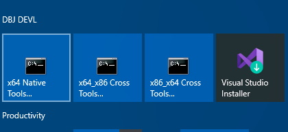
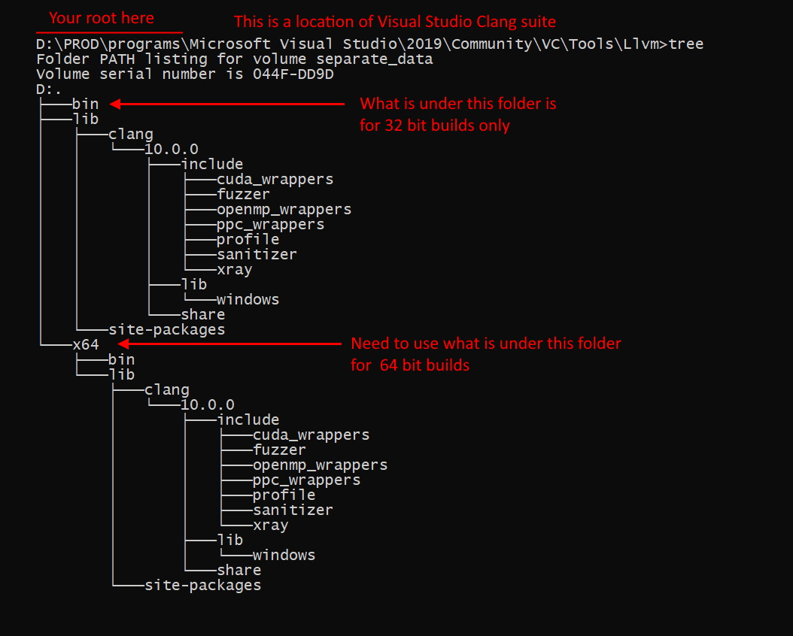

<h1> clang + VS Code, on Windows 10</h1>

- [1. Difficult path](#1-difficult-path)
- [2. The right path](#2-the-right-path)
- [3. Moral of the story](#3-moral-of-the-story)
  - [3.1. Post Scriptum](#31-post-scriptum)

You want (or need) to use VS Code to build your C/C++ projects on your machine using clang that comes packaged with Visual Stidio 2019. You have installed all the required extensions. And now you are ready to use clang and compile away. The key extension is: [C/C++ for Visual Studio Code](https://marketplace.visualstudio.com/items?itemName=ms-vscode.cpptools). 

To use VSCode to compile C++ with that, (you quickly realise) you need to install either [Visual Studio 2019](https://visualstudio.microsoft.com/vs/community/) or [Build Tools for Visual Studio 2019](https://visualstudio.microsoft.com/thank-you-downloading-visual-studio/?sku=TestAgent&rel=16)

And you have already learned you have to install Visual Studio 2019 `clang` too. 

From Visual Studio, clang build "just works". But you want to use VS Code because you are in total control of the numerous, arcane, ridiculous and beautifull command line switches of the cl.exe compiler and its llvm specialy prepared `cl.exe` alter ego: `clang-cl.exe`. 

Now [as you have been instructed](https://code.visualstudio.com/docs/cpp/config-msvc) by [C/C++ for Visual Studio Code](https://marketplace.visualstudio.com/items?itemName=ms-vscode.cpptools), you use one of the VStudio installed "Command Prompt" icons on your start menu to open the cmd.exe and execute the `vcvarsall.bat` in a proper way. All done for you.



And now you are in the command prompt from which you can execute the `code` and proceed to your C++ folder. 

> What can possibly go wrong?&trade;

You are bright and quick and in no time you compile and even debug your c++ from your VSCode. All based on this `tasks.json`, automagically made for you by VSCode and that C++ extension

```json
{
  "version": "2.0.0",
  "tasks": [
    {
      "type": "shell",
      "label": "cl.exe build active file",
      "command": "cl.exe",
      "args": [
        "/Zi",
        "/EHsc",
        "/Fe:",
        "${fileDirname}\\${fileBasenameNoExtension}.exe",
        "${file}"
      ],
      "problemMatcher": ["$msCompile"],
      "group": {
        "kind": "build",
        "isDefault": true
      }
    }
  ]
}
```

But now you want to use `clang-cl.exe` as a llvm version of the `cl.exe`. You realize it is not on the path so you copy your default building configuration that VS Code has generated for you, and you just add the full path to it in your VS Code `taks.json`. Thus the critical line is now this:

(elipsis aka `...` is the root of your VS2019 installation)

```cpp
"command": "...\\Microsoft Visual Studio\\2019\\Community\\VC\\Tools\\Llvm\\bin\\clang-cl.exe",
```
Everythig else is the same as before. And lo and behold! That works and you compile using `clang-cl`. 

But alas! The linker refuses to link. For me on my machine the message was this:

```
msvcrtd.lib(chkstk.obj) : fatal error LNK1112: module machine type 'x64' conflicts with target machine type 'x86'
clang-cl: error: linker command failed with exit code 1112 (use -v to see invocation)
The terminal process "C:\WINDOWS\System32\cmd.exe /d /c "D:\PROD\programs\Microsoft Visual Studio\2019\Community\VC\Tools\Llvm\bin\clang-cl.exe" /ID:\DEVL\serverside.systems\bench\EASTL2020CORE\include /std:c++17 /DUNICODE /D_UNICODE /D_DEBUG /Zc:wchar_t /Zi /MDd /FeD:\DEVL\serverside.systems\bench/bench_dbg.exe D:\DEVL\serverside.systems\bench/fwk/main.cpp D:\DEVL\serverside.systems\bench/program.cpp D:\DEVL\serverside.systems\bench\units\*.c D:\DEVL\serverside.systems\bench\units\*.cpp D:\DEVL\serverside.systems\bench\EASTL2020CORE\source\*.cpp" terminated with exit code: 1112.
```

Admitedly a message from hell. Perhaps translated into human it might be: "Back off boy! You are in the real man developers teritory. Leave while you can."

"But wait... stay!". You hear the voice. "Trust me, I will solve this for you. Let me take you down this..."

## 1. Difficult path

Step One. Click on that unavoidable VStudio command line icon again: 


Now, goto the clang bin directory. Execute `clang-cl --version`. (On my `W10` machine that displays:)

```
C:\Microsoft Visual Studio\2019\Community\VC\Tools\Llvm\bin>clang-cl --version
clang version 10.0.0
Target: i686-pc-windows-msvc
Thread model: posix
InstalledDir: C:\Microsoft Visual Studio\2019\Community\VC\Tools\Llvm\bin
```

Aha! That `Target` means clang-cl indeed "just works", but only for 32 bit command line builds. Dont ask, just trust me. Therefore! It will not link if you start the VS Code from Visual Studio 64 bit command line prompt, opened after `vcvars64.bat` is executed.(it is behind that VSutdio CLI icon above) 

Now, I have to tell you:

```
--target=x86_64-pc-windows-msvc
```

is a necessary switch for clang-cl 64 bit builds. Again, don't ask.

Without that arcane,ridiculous, beautiful switch, linker will not link after `clang-cl` succesfully compiles your C++, in a 64 bit mode. From your VS Code on Windows 10. Your `tasks.json` is now this:

```json
{
  "version": "2.0.0",
  "tasks": [
    {
      "type": "shell",
      "label": "clang-cl active file debug build",
"command": "...\\Microsoft Visual Studio\\2019\\Community\\VC\\Tools\\Llvm\\bin\\clang-cl.exe",
      "args": [
          "--target=x86_64-pc-windows-msvc",
        "/Zi",
        "/EHsc",
        "/Fe:",
        "${fileDirname}\\${fileBasenameNoExtension}.exe",
        "${file}"
      ],
      "problemMatcher": ["$msCompile"],
      "group": {
        "kind": "build",
        "isDefault": true
      }
    }
  ]
}
```

And now it compiles and links. You are in the business! ["You are in the grove Jackson!"](https://youtu.be/m7COYi2_58g). 

Job done? Well ... there is this thing we usually call:

## 2. The right path

It is a short and simple path. You have gone to the wrong bin directory in the step one. As taken by me. 

> The whole point of the excersize is to match the right clang-cl.exe to x86 or x64 builds. 
 
Now, after a long "`devl` night", it is a sunny morning, and first shoot of caffeine kicks in. And looking into:

`...\Microsoft Visual Studio\2019\Community\VC\Tools\Llvm\`

This morning, you spot the `x64` and you spot the `bin` under it. 



Yes! That is where the clang-cl for 64 bit builds is. 

> Of course there is a question: If there is `x64` folder why is there no `x86` folder?

Anyhow, the above difficult path was not the right path. It is a bit of a moot point why we went down that path in the first place. (Who me?) Instead , one could just use the `clang-cl.exe` made for x64 and all will be fine. Let's check.

```
...\Microsoft Visual Studio\2019\Community\VC\Tools\Llvm\x64\bin>clang-cl --version
clang version 10.0.0
Target: x86_64-pc-windows-msvc
Thread model: posix
InstalledDir: ...\Microsoft Visual Studio\2019\Community\VC\Tools\Llvm\x64\bin
```

Spot the `Target`, again. Do you, get it? Good.

The right command in yuor tasks.json is to be: (replace `...` with the root of your installation )

```cpp
"command": "...\\Microsoft Visual Studio\\2019\\Community\\VC\\Tools\\Llvm\\x64\\bin\\clang-cl.exe",
```

Compiles, links, runs. That is for the 64 bit clang-cl builds only. No need to fiddle with that target switch:

```json
{
  "version": "2.0.0",
  "tasks": [
    {
      "type": "shell",
      "label": "clang-cl active file X64 debug build",
"command": "...\\Microsoft Visual Studio\\2019\\Community\\VC\\Tools\\Llvm\\x64\\bin\\clang-cl.exe",
      "args": [
        "/Zi",
        "/EHsc",
        "/Fe:",
        "${fileDirname}\\${fileBasenameNoExtension}.exe",
        "${file}"
      ],
      "problemMatcher": ["$msCompile"],
      "group": {
        "kind": "build",
        "isDefault": true
      }
    }
  ]
}
```

## 3. Moral of the story

The right path is not always the difficult one.

### 3.1. Post Scriptum

In case you have free time to waste please use ["Rapid Environment Editor"](https://www.rapidee.com/en/about) to study what is going on as a result of running `vcvarsall.bat`. The most ridiculuous and beautiful batch file to be found in the depths of the Visual Studio 2019 installation.

My [settings.json](../settings.json), is just above this folder and you can look it up.