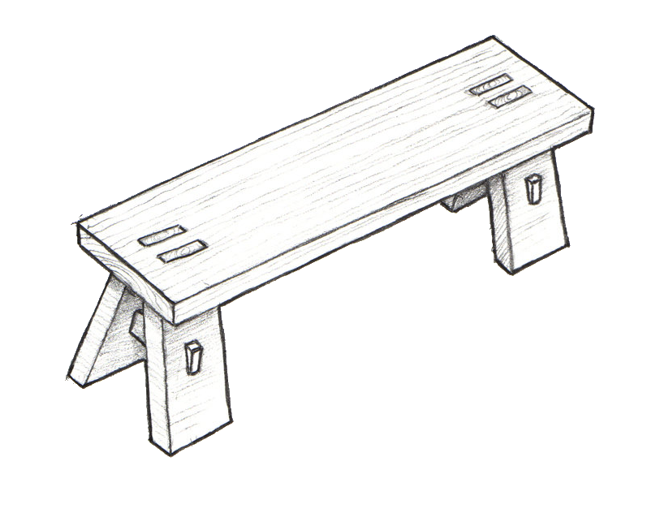

<h1>dbj*bench</h1>
(c) 2020 by dbj@dbj.org 

Please check the [license](https://dbj.org/license_dbj/)

There are some more readme's scattered bellow this one; please use them.

## Principles

### Architecture

Architecture rules. No architecture no success.

### serverside.systems bench

- Using sheredom ubench and utest. Which are both modified.
- not using Cmake, nmake, msbuild or any other building system (bazel is rather good) 
- using Visual Studio (2019)
     - solution for the whole is in the folder `benchvs`
- we do prefer clang-cl to cl
- VS is used to making lib's
- using static libs (not dll's)
    - among other dll problems some key clang-cl features do work with `/MT` but not with `/MD`
        - like `__attribute__((destructor))`
- for full build control (apart of lib's) using VS Code and C/C++ extension (CCE)
    - intelisense is problematic anyway but using CCE and clang-cl it simply is broken
        - VS version works much better 
    - not using .clang-format with VS  because it is incredibly slow?
    - not using vcpkg because it is a good idea over-engineered (as many other MSFT projects are)
  
### What does "serverside" mean?

- Windows only
    - no GUI
    - no Console
    - logging is very important 
- preffering C to C++ (but not in a religious way)
    -  WIN32 is (some undefined) C API
          -  undefined but very close to (K&R) ANSI C
          -  2020 Q4: C11 and C17 are (at last) becoming officialy supported at least by cl.exe
                -  mistery decision makers have decided  *no* VLA
- clang + WIN32
    -  using VLA but [not for stack abuse](https://gustedt.wordpress.com/2014/09/08/dont-use-fake-matrices/)
    -  VLA typedefs and VLA based heap allocation are the key.
- SEH is [unavoidable](https://docs.microsoft.com/en-us/cpp/cpp/structured-exception-handling-c-cpp?view=msvc-160) on Windows
    -  that is what `fwk` lib is for
- COM is unavoidable too; it is based on MSRPC which stil rules.
    - comdef.h was good, it seems abandoned but nobody knows for certain
        - that is the problem with all Windows API's "legacy things", like WSH.
    - ATL was good but it is ancient C++ with a lot of inheritance and a "wall of macros"
    - comdef.h and "direct COM" based clients are (still) part of the cl.exe
        - much cleaner com clients

## PS

Why this `dbj` prefix everywhere, ego trip? No. It is just the easy way to have unique names on the GitHub. That is the only reason.

[Serverside Systems](https://github.com/dbj-data) is part of [dbj.systems](.https://dbj.systems) group.

