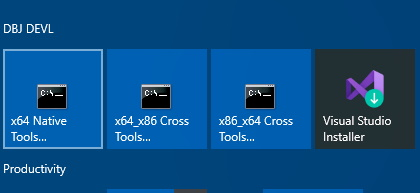

<h1> How to setup building with clang-cl and VS Code, on Windows 10</h1>

- [1. Introduction](#1-introduction)
  - [1.1. Garden path](#11-garden-path)
  - [1.2. The right path](#12-the-right-path)
    - [1.2.1. Trouble shooting](#121-trouble-shooting)
  - [1.3. The path of the light work](#13-the-path-of-the-light-work)
    - [1.3.1. Slight Detour](#131-slight-detour)
  - [1.4. Moral of the story](#14-moral-of-the-story)
    - [1.4.1. Post Scriptum](#141-post-scriptum)

# 1. Introduction

You want (or need) to use VS Code to build your C/C++ projects on your Windows 10 machine using clang and cl. You have installed all the required VS Code (C++)extensions. And now you are ready to use clang and compile away. The key Code extension is: [C/C++ for Visual Studio Code](https://marketplace.visualstudio.com/items?itemName=ms-vscode.cpptools). 

To use VSCode to compile C++ without Visual Studio, (you quickly realise) you need to install [Build Tools for Visual Studio 2019](https://visualstudio.microsoft.com/thank-you-downloading-visual-studio/?sku=TestAgent&rel=16). And you have already learned you have to install Visual Studio 2019 `clang` too, while in that process.

From Visual Studio IDE, clang build "just works". But you want to use VS Code because you are in total control of the numerous, arcane, ridiculous and beautiful command line switches of the cl.exe compiler and its llvm specialy prepared `cl.exe` alter ego: `clang-cl.exe`. 

Now [as you have been instructed](https://code.visualstudio.com/docs/cpp/config-msvc) by [C/C++ for Visual Studio Code](https://marketplace.visualstudio.com/items?itemName=ms-vscode.cpptools), you use one of the VStudio installed "Command Prompt" icons on your start menu to open the cmd.exe and execute the `vcvarsall.bat` in a proper way. All done for you.



The very next thing is to check both cl and clang-cl are available


And now you are in the command prompt from which you can execute the `code` and proceed to your C++ project folder. 

> What can possibly go wrong?&trade;

You are bright and quick and in no time you compile and even debug your c++ from your VSCode, using default setup generated by VS Code and using cl.exe. Thus, `tasks.json`, is automagically made for you by VSCode and that VS Code C++ extension

```json
{
  "version": "2.0.0",
  "tasks": [
    {
      "type": "shell",
      "label": "cl.exe build active file",
      "command": "cl.exe",
      "args": [
        "/Zi",
        "/EHsc",
        "/Fe:",
        "${fileDirname}\\${fileBasenameNoExtension}.exe",
        "${file}"
      ],
      "problemMatcher": ["$msCompile"],
      "group": {
        "kind": "build",
        "isDefault": true
      }
    }
  ]
}
```

But now you want to use `clang-cl.exe` as a llvm version of the `cl.exe`. You know (because you checked) clang-cl is on the path so you copy your default building configuration that VS Code has generated for you, and you just replace `cl` with `clang-cl` in your VS Code `taks.json`. But that does not work. 

Then you replace `clang-cl` with the full path to it in your VS Code `taks.json`. Thus the critical line is now this: (elipsis aka `...` is the root of your VS2019 installation)

```cpp
"command": "...\\Microsoft Visual Studio\\2019\\Community\\VC\\Tools\\Llvm\\bin\\clang-cl.exe",
```
Everythig else is the same as before. And lo and behold! That works and you compile using VS Code and  `clang-cl`. 

But alas! The linker refuses to link. For me on my machine the message was this:

```
msvcrtd.lib(chkstk.obj) : fatal error LNK1112: module machine type 'x64' conflicts with target machine type 'x86'
clang-cl: error: linker command failed with exit code 1112 (use -v to see invocation)
The terminal process "C:\WINDOWS\System32\cmd.exe /d /c "D:\PROD\programs\Microsoft Visual Studio\2019\Community\VC\Tools\Llvm\bin\clang-cl.exe" /ID:\DEVL\serverside.systems\bench\EASTL2020CORE\include /std:c++17 /DUNICODE /D_UNICODE /D_DEBUG /Zc:wchar_t /Zi /MDd /FeD:\DEVL\serverside.systems\bench/bench_dbg.exe D:\DEVL\serverside.systems\bench/fwk/main.cpp D:\DEVL\serverside.systems\bench/program.cpp D:\DEVL\serverside.systems\bench\units\*.c D:\DEVL\serverside.systems\bench\units\*.cpp D:\DEVL\serverside.systems\bench\EASTL2020CORE\source\*.cpp" terminated with exit code: 1112.
```

Admittedly a message from hell. Perhaps translated into human it might be: "Back off boy! You are in the real man developers territory. Leave while you can." "But wait... stay!". You hear the voice. "Trust me, I will solve this for you. Just let me take you down this..."

## 1.1. Garden path

Step One. Click on that unavoidable VStudio command line icon again: 


Now, goto the clang bin directory. Execute `clang-cl --version`. (On my `W10` machine that displays:)

```
C:\Microsoft Visual Studio\2019\Community\VC\Tools\Llvm\bin>clang-cl --version
clang version 10.0.0
Target: i686-pc-windows-msvc
Thread model: posix
InstalledDir: C:\Microsoft Visual Studio\2019\Community\VC\Tools\Llvm\bin
```

Aha! That `Target` means clang-cl indeed "just works", but only for 32 bit command line builds. Don't ask why, just trust me. Therefore we can conclude! That build from VS Code will not link if you start the VS Code from Visual Studio 64 bit command line prompt, opened after `vcvars64.bat` is executed.(it is behind that VSutdio CLI icon above) 

Now, I have to, and I will, tell you:

```
--target=x86_64-pc-windows-msvc
```

is a necessary switch for clang-cl 64 bit builds. Again, don't ask why is that not default.

Without that arcane,ridiculous, beautiful switch, linker will not link after `clang-cl` successfully compiles your C++, in a 64 bit mode. From your VS Code on Windows 10. THus your `tasks.json` is now this:

```json
{
  "version": "2.0.0",
  "tasks": [
    {
      "type": "shell",
      "label": "clang-cl active file debug build",
"command": "...\\Microsoft Visual Studio\\2019\\Community\\VC\\Tools\\Llvm\\bin\\clang-cl.exe",
      "args": [
          "--target=x86_64-pc-windows-msvc", /* the crucial incantation */
        "/Zi",
        "/EHsc",
        "/Fe:",
        "${fileDirname}\\${fileBasenameNoExtension}.exe",
        "${file}"
      ],
      "problemMatcher": ["$msCompile"],
      "group": {
        "kind": "build",
        "isDefault": true
      }
    }
  ]
}
```

And now it compiles and links. You are in the business! ["You are in the grove Jackson!"](https://youtu.be/m7COYi2_58g). 

Job done? Well ... there is this thing we usually call:

## 1.2. The right path

It is a short and simple path. You have gone to the wrong bin directory in the step one. As taken by me. Sorry. 

> The whole point of the exercise is to match the right clang-cl.exe executable, to x86 or x64 builds. 
 
Now, after a long "devl night", it is a sunny morning, and first shoot of caffeine kicks in. And looking into:

`...\Microsoft Visual Studio\2019\Community\VC\Tools\Llvm\`

This morning, you spot the `x64` and you spot the `bin` under it. 


Yes! That is where the clang-cl for 64 bit builds is. 

> Of course there is your question: If there is `x64` folder why is there no `x86` folder?

Anyhow, the above difficult path was not the right path. It is a bit of a moot point why we went down that path in the first place. (Who me?) Instead , one could just use the `clang-cl.exe` made for x64 and all will be fine. Let's check. (Spot the `x64` in the path)

```
...\Microsoft Visual Studio\2019\Community\VC\Tools\Llvm\x64\bin>clang-cl --version
clang version 10.0.0
Target: x86_64-pc-windows-msvc
Thread model: posix
InstalledDir: ...\Microsoft Visual Studio\2019\Community\VC\Tools\Llvm\x64\bin
```
Npw spot the line `Target:`, again. Do you, get it? Good.

Now we know, the right command in yuor tasks.json is to be: (replace `...` with the root of your installation )

```cpp
"command": "...\\Microsoft Visual Studio\\2019\\Community\\VC\\Tools\\Llvm\\x64\\bin\\clang-cl.exe",
```
Compiles, links, runs! That is for the 64 bit clang-cl builds only. No need to fiddle with that target switch, that executable is compiler built to compile  in x64 mode and pass the thing to the compile to link in the same x64 mode,

```json
{
  "version": "2.0.0",
  "tasks": [
    {
      "type": "shell",
      "label": "clang-cl active file X64 debug build",
"command": "...\\Microsoft Visual Studio\\2019\\Community\\VC\\Tools\\Llvm\\x64\\bin\\clang-cl.exe",
      "args": [ /* using the x64 compiler does not require --target switch */
        "/Zi",
        "/EHsc",
        "/Fe:",
        "${fileDirname}\\${fileBasenameNoExtension}.exe",
        "${file}"
      ],
      "problemMatcher": ["$msCompile"],
      "group": {
        "kind": "build",
        "isDefault": true
      }
    }
  ]
}
```

### 1.2.1. Trouble shooting

All of this requires focus, knowledge and experience. Most of the time problems with VS Code do arise when you move to another machine. It can be a very different machine and things need readjusting. 

In case some of these builds "suddenly" stop working, just open the terminal from VS Code and type `cl`. Part of your output will be very similar to this:

```
Microsoft (R) C/C++ Optimizing Compiler Version 19.27.29112 for x86
Copyright (C) Microsoft Corporation.  All rights reserved.
```

What that means? 

That means you have `cl` on the path which is a good thing. That also means it is a 32 bit version. See that "for x86"? So it is very likely your clang-cl version, in the settings.json, is still the 64 bit one. And you can non not link. Just change it to 32 bit version, as instructed above, at length.

Possible Remedy

In case cl can not be found, close the VS. Click again on one of those icons and start the code again.  That will set up the required environment for you.

## 1.3. The path of the light work

Always welcome. Let us think. We have learned if we have `cl` available in the VS Code terminal we will have `clang-cl` too. So why do not we produce a simple batch file to compile in a normal way whatever we want to compile? 

```bat
:: build.bat (c) 2021 dbj at dbj dot org
@cls

@if [%1] == [clean] goto clean

:build
clang-cl /std:c++17 /Zi main.c square_matrix.cpp /o out/comp.exe
@goto exit

:clean
@del out\*.pdb
@del out\*.ilk
@del out\*.exe
@goto exit

:exit
```

That "just works". Ridiculously simple after all the hoops we have jumped through, to achieve the same without a batch file from inside the VS Code.

### 1.3.1. Slight Detour

In case you are healthily curious, please use ["Rapid Environment Editor"](https://www.rapidee.com/en/about) to study what is going on as a result of running `vcvarsall.bat`. The most ridiculous and beautiful batch file to be found in the depths of the Visual Studio 2019 installation. Although, there is a lot of "ridiculous and beautiful" things in there.

## 1.4. Moral of the story

> The right path is not always the difficult one.

### 1.4.1. Post Scriptum 

If you happen to have `g++` on the same machine. VS Code "Configure Default Build Task" will have no problem whatsoever to create the right `tasks.json`

```json
{
			"type": "cppbuild",
			"label": "C/C++: g++.exe build active file",
			"command": "D:\\PROD\\TDM-GCC-64\\bin\\g++.exe",
			"args": [
				"-g",
				"${file}",
				"-o",
				"${fileDirname}\\${fileBasenameNoExtension}.exe"
			],
			"options": {
				"cwd": "${workspaceFolder}"
			},
			"problemMatcher": [
				"$gcc"
			],
			"group": {
				"kind": "build",
				"isDefault": true
			},
			"detail": "compiler: D:\\PROD\\TDM-GCC-64\\bin\\g++.exe"
		}
```
That was correctly created on one machine  with very non-standard `g++` location.

We are waiting on the VS Code crew to add  `task.json` generation for clang-cl enabled building.
