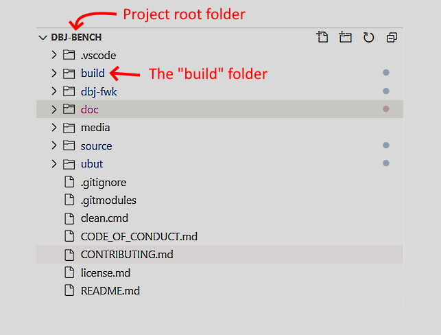
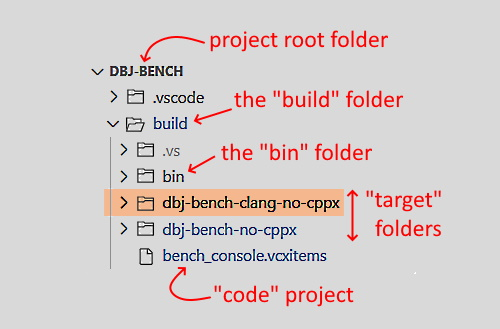
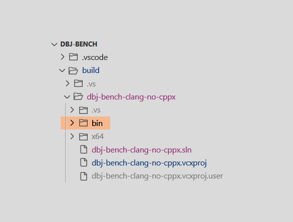
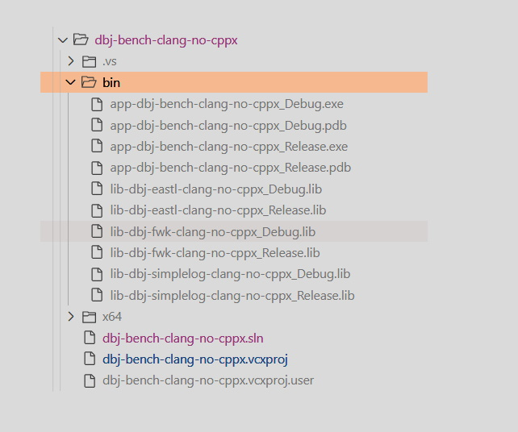

We shall be using the "dbj-bench" project as the real life use-case

- One project is mapped to one or more Visual Studio Solutions
- One build target is mapped to one Visual Studio Solution
  - The term is: "**Solution Targe**t"
- Solution Target is made of one or more projects and one "shared project"
  - "shared project" is the single place where the source code is
- Other projects are **libraries**.
  - Referenced to the "Solution Target" using VStudio project referencing mechanism


# 1. Folder project structure


## 1.1. Each project has one "build" folder



Being exe or lib or dll, each project has to have the "build" folder.

## 1.2. Build folder structure

Each project build folder has the same structure. This project "build" folder, actual current layout is:




### 1.2.1. Build folder has "Target" folders

One per target. **Target Folder** name is structured as: 

```
<app name> '-' <compiler name> '-' <other target attributes>

Target attribites
-------------------

'no-cppx' -- no cpp exceptions
             remember SEH is always present
             on Windows
```

Target Folder does contain "Target Solution" and the base Visual Studio project.

### 1.2.2. Build folder has one "shared code" project 

Project source code is in this project. Nowhere else.
This project is reference to all the "Solution Targets" for this project.

**Use "Shared Projects" to decouple code from usual projects**

That is how to reuse more effectively same source for many Solution Targets aka "builds".

- This is single place where source code is added or removed. 
- Do not add source code anywhere else but in "shared code" projects
- Visual Studio [Shared Projects](https://docs.microsoft.com/en-us/xamarin/cross-platform/app-fundamentals/shared-projects?tabs=windows) 

## 1.3. Target Folder structure

One target folder contains one Target Solution and one or more projects. There is more if libraries are build and used as part of the project.



The build result is landing into the target bin folder.

Building artefacts are landing into thje x64 folder, as ususal for 64bit targets.

.vs is usual Visual Studio private temporary (hidden) folder.

Library projects are added and references to the Target Solution. Thus, they are landing into the bin folder here.

That is doen by using the `/OUT` linker switch. It is not default and it is manually defined as:
```
$(OutDir)$(TargetName)$(TargetExt)
```
In each library and host exe project setting for a linker.

where "Output Directory" is also manualy set in the project configuration General Properties as
```
$(SolutionDir)bin
```
And "Target Name" is also manually set as
```
$(ProjectName)_$(Configuration)
```

Using the target solution and all the added projects make sure all those project setting are set as above.

That is used by linker in the final stage so that lib's are found and linked into the final exe

## Each lib is a multi-target build composed  by this same principles

Currently Solution Target bin folder looks like this



That is an app called "dbj-bench" that uses three libraries:

1. dbj-fwk
2. dbj-simplelog
3. dbj-eastl

All of them and the host app are built under the same Solution Target; using the clang-cl compiler set to have no cpp exceptions. 

As usual each target is build in "Debug" and "Release" forms.


  


