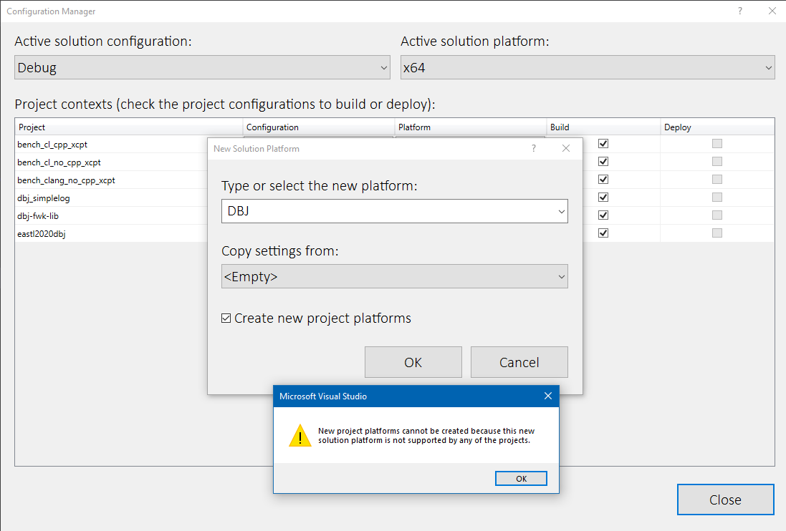

Visual Studio does not help

<h1>You do not want to guess</h1>

- [Let me make it clearer for you, if I can.](#let-me-make-it-clearer-for-you-if-i-can)
- [2 builds. 6 for testing and 6 for benchmarking](#2-builds-6-for-testing-and-6-for-benchmarking)
- [Testing == 6 Debug builds](#testing--6-debug-builds)
- [Benchmarking == 6 Release builds](#benchmarking--6-release-builds)
- [What about libraries?](#what-about-libraries)
- [What about platform?](#what-about-platform)
- [So how do you make an measurement?](#so-how-do-you-make-an-measurement)
  - [Testing](#testing)
  - [Benchmarking](#benchmarking)

As far as I know there is no suitable "build system" for one man "C++ naut". Visual Studio is very comfortable. To a certain point.

So, let us think first.

Your code is C++ and you are delivering Windows solutions. Good. You are engineer. You need to make sure you know, not guess, what build is the *best build*. That is: using the same code. 

Here are the key attributes of any standard c++, standard Windows build.

1. Compiler: cl.exe or clang-cl.exe
   1. On Windows, the two most up to date + feasible to use
      1. By feasible I mean: easy to install and setup on Windows. Nothing can match Visual Studio in that respect.
      2. By "up to date" I mean the latest ISO standards conformant. That means: C++20 and C18.
      3. More important: with less bugs than previous release. Regardless of standards conformance.
      4. If you can prove to your team there is a better compiler for your product, please do use that one.
2. [C++ exception](http://www.open-std.org/jtc1/sc22/wg21/docs/papers/2019/p0709r4.pdf) or not C++ exceptions
3. [SEH](https://docs.microsoft.com/en-us/cpp/cpp/structured-exception-handling-c-cpp?view=msvc-160). It is always there. Use that or do not use that fact of Windows builds.
4. Debug or Release build. 
   1. Testing needs Debug builds
   2. Benchmarking needs Release build

## Let me make it clearer for you, if I can.

- cpp files are the prevailing "compilation units"
  - h files are headers 
- you "drop into C" from time to time?
  - the Windows builds issue is: using cl.exe one can not mix fully conformant ISO C with C++ in the same cpp file, and that is because of the compiler
    - when using cl.exe you have to use c file to enjoy fully [C11 or C17](https://docs.microsoft.com/en-us/cpp/build/reference/std-specify-language-standard-version?view=msvc-160)
    - when using clang-cl.exe you can mix C11 code `extern "C"` blocks, with c++ code in the same cpp file
- building platform : WIN 10 x64
- running  platform : WIN 10 x64

## 2 builds. 6 for testing and 6 for benchmarking

- No C++ exceptions and no SEH use is a valid build too
  - that is where ["fail fast" is used](https://docs.microsoft.com/en-us/cpp/intrinsics/fastfail?view=msvc-160#:~:text=The%20__fastfail%20intrinsic%20provides,to%20request%20immediate%20process%20termination.&text=After%20a%20fast%20fail%20request,then%20takes%20the%20appropriate%20action.)
- What about the cl [/kernel switch](https://docs.microsoft.com/en-us/cpp/build/reference/kernel-create-kernel-mode-binary?view=msvc-160)?
  - If you use that cl.exe swtich, that means: no C++ exceptions and no [RTTI](https://docs.microsoft.com/en-us/cpp/cpp/run-time-type-information?view=msvc-160). 
  - But you need to switch of the RTTI manually.

Here are the builds tabulated:

## Testing == 6 Debug builds

|   | Attribute      | Build 01| Build 02| Build 03| Build 04| Build 05| Build 06
|---|----------------|-------- |---------|---------|---------|---------|---------|
| 1 | cl.exe         | Y       | Y       | Y       |         |         |         |
| 2 | clang-cl.exe   |         |         |         |  Y      | Y       | Y       |
| 3 | c++ exceptions | Y       |         |         |  Y      |         |         |
| 4 | use SEH        | Y       | Y       |         |  Y      | Y       |         |

## Benchmarking == 6 Release builds

|   |  Attribute     | Build 07| Build 08| Build 09| Build 10| Build 11| Build 12
|---|----------------|-------- |---------|---------|---------|---------|---------|
| 1 | cl.exe         | Y       | Y       | Y       |         |         |         |
| 2 | clang-cl.exe   |         |         |         |  Y      | Y       | Y       |
| 3 | c++ exceptions | Y       |         |         |  Y      |         |         |
| 4 | use SEH        | Y       | Y       |         |  Y      | Y       |         |

## What about libraries?

Library is a kind of a executable. Each library has to match the build attributes of the host executable. That means, each library will have to be built in 12 builds too.

## What about platform?

Following the Visual Studio nomenklature, platforms are:

- x86
- x64
- Win32
- ARM
- ARM64

One might consider the platform as one of the key attributes of the build. That will increase the number of possible builds considerably.

Instead, we consider the platform as the attribute of the run-time environment.

Run-time is:

- Windows 10 x64
- Intel x64 CPU 
- C++16
- C18

## So how do you make an measurement?

The key piece of logic behind this text is: you do want to go beyond guessing when deciding what to use and how to build it, while coding in C++. 

### Testing

In the context of testing, different testing debug builds will tell you if your code can be built in all 6 varieties. 

And if it can be built, will it fail at runtime.

By no means first test then measure.

### Benchmarking

Benchmarking are the best use cases to clarify why do we useall these builds. For example you write the code comparing the speed of `std::vector` and `stl::vector`. You have your own or using some well known benchmarking framework. (I use mine, very closely related to [ubench](https://github.com/sheredom/ubench.h)/[utest](https://github.com/sheredom/utest.h).)

- you use the same code to produce all the different release builds
  - each build will produce benchmarking results inside one build
- next you compare builds by taking into account their key attributes

Examples :  

- which compiler produces faster builds?
  - Release "Build 07" and "Build 10" are different only by the compiler used. 
  - what is the difference in benchmarking results comparing these two builds?
- are C++ exception builds slower?
  - you could compare "Build 10" with "Build 11"
- are C++ exception builds slower or faster by using different compilers?
   - compare the "Build 10" and "Build 07" results
- How fast are SEH builds vs C++ exception builds?
  - compare builds 07 and 08 , or 10 and 11
- What about fail fast builds?
  - compare 10 and 12, or 07 and 09
- Which release produces the smallest executables?
  - Take your pick. You have 6 builds to choose from.

In any case you have different builds to give one more dimension in order t increase the value of your measurements results. To make your benchmarks less of a guess and more of a engineering measurement approach.

---
&copy; 2020 by dbj@dbj.org , [LICENSE_DBJ](https://dbj.org/license_dbj)

